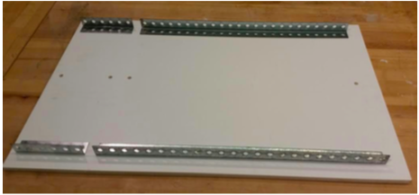
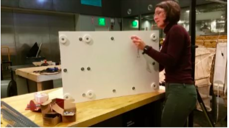
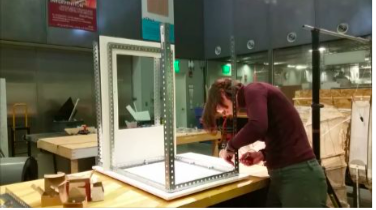
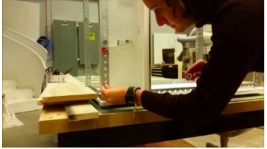
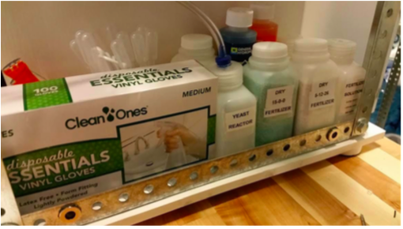

# Main Frame Assembly Guide

## Parts

  * PVC base board
  * PVC motherboard wall
  * 6 x 2” diameter PVC standoffs
  * 6 x 2” self adhesive anti­skid surface pads Punched angle
    * 2 x 31 1⁄2” 4 x 30”
    * 4 x 24”
    * 7 x 18”
    * 4 x 6”
    * 2 x 1”
  * 26 x 3⁄8”­16 1” bolts
  * 46 x 3⁄8”­16 1⁄2” bolts 83 x 3⁄8”­16 nuts
  * 84 x 3⁄8” washers
  * 10’ weatherstrip tape

## Tools

  * 3⁄8” ratchet
  * 3⁄8” crescent wrench

## Instructions

1.   Place the PVC base board on a flat surface with the faux wood side down. The 6 holes on the left side outline the base of the electronics chamber, and the 10 holes on the right side outline the base of the grow chamber.

    

2.  Lay out 2 of the 6” punched angle lengths electronics side and 2 of the 24” punched angle lengths on the grow side as shown.

    

3.  Lay out 2 of the 18” punched angle lengths on the outermost sides of the base board and another on the right side of the electronics chamber side as shown. Secure this base frame with the 1” bolts on all non­corner through holes. Use washers on both sides of the board and put the heads of the bolts on the underside of the board.

    

4.  Place 1” bolts through 4 of the standoffs making sure the heads of the bolts are on the countersunk side of the standoffs.

    

5.  Insert these standoffs through the 4 outermost corner holes of the base board with the standoffs on the underside of the base board. Do not use washers on either side of the bolt. Make sure the bottom of your base board matches the picture below.

    

6.  Set the PVC motherboard wall on the table with the faux wood side down. Place 2 of the 30” punched angle lengths along the length of the board. Use 1” bolts with washers on each side to secure the 30” lengths to the board through the 4 aligning non­corner through holes. Orient the bolts such that heads are on the punched angle side of the wall.

    

7.  Place 1 of the 18” punched angle lengths along the top of the motherboard wall and use a 1” bolt to secure the 18” length at its center through the PVC motherboard wall.

    

8.  Now align the motherboard wall perpendicular to the base board, with the punched angle parts secured to the motherboard wall facing the grow chamber side as shown. Place 1 more of the 18” punched angle lengths at the base of the motherboard wall on the grow chamber side. Secure the 18” length to the motherboard wall and 18” length on the other side using 1” bolts with no washers at the two bottom corners and single center through hole. Orient the bolts such that heads are on the grow side of the motherboard wall.

    

9.  Set the frame on its side to insert the last standoffs and 1” bolts through the base board such that the bottom looks as shown. For the last 2 standoffs, do not use washers. For the rest, use washers only on the bottom of the base board. Tighten all bolts and standoffs with the ratchet and crescent wrench.

    

10.   Peel the paper off the backs of the 6 anti­skid pads and stick them to the standoffs as shown.

    

11.   Put the 1” angle brackets on the bolt ends on the electronics side of the motherboard wall. Orient the brackets as shown below. Secure each end with 1” bolts and no washers.

    

12.   Use the 2 30 1⁄2” punched angle lengths as the vertical posts on the outermost electronics chamber side, making sure that the end of the length with the cut through a punched hole is towards the top. Use the 1⁄2” bolts to secure the bases, with washers on the outside but not the inside of the punched angle corners. Make sure the intersections between angle parts are approximately perpendicular.

    

13.   Use the last 2 30” punched angle lengths for the outermost vertical posts on the grow chamber side of the frame. Again, use 1⁄2” bolts with washers on the outside and not the inside of the punched angle corners. Make sure the intersections between angle parts are approximately perpendicular.

    

    

14.   Install the top 18” angle part depths on the farthest left and right sides of the assembly with the 1⁄2” bolts with washers on the outside head sides of the bolts. Install the top 6” widths on the electronics chamber side, securing the two outer corners with 1⁄2” bolts with washers on the top side.

    

15.   Place the grow side top width 24” angle parts, making sure they are placed above the 18” top depth parts but inside the vertical posts.

    

16.   Get a top­down view of the assembly now, by either standing on the table or bringing the assembly down onto the floor. Secure the 6 corners with the last 1⁄2” bolts, with heads and washers on the top of the frame and nuts without washers on the underside.

17.   Do some last adjusting if the frame is crooked. Check each corner to make sure all pairs of angle bracket are perpendicular to each other. You may have to do some loosening and retightening of bolts.

18.   Now to make the seal between the main frame and jacket. Take your weatherstripping and line the base of the PVC base board on the grow side with it. Make sure the edge of the weatherstripping is right along the edge of the base but not protruding over the edge as this will make sliding the clam shell jacket over difficult or impossible. Do the same along the edge of the grow side of the PVC motherboard wall.

    

19.   Now, weatherstrip around the edge of the PVC motherboard wall cutout on the electronics chamber side. This will act as the seal when the electronics panel is pressed against the weatherstripping and bolted onto the motherboard wall.

    

20.   Take the laser cut front upper plate and back plate and install onto front and back faces of the punched angle frame on the electronics side, respectively. Use the 1⁄2” bolts and washers on the outer face and just nuts on the inner face.

    

21.   Find 20 of the magnets and put VHB tape onto one side, making sure the polarity orientation is the same for all 20. Tape 4 of the magnets along the punched angle that outlines the place of the front lower plate and 6 of the magnets along the punched angle that outlines the place of the side plate.

22.   Put the front lower plate against the punched angle, and align another set of magnets with those taped directly to the punched angle. Tape the new magnets onto the front lower plate.

    

23.   Do the same with the last 6 magnets and the side plate.

## Assemble the kit section

This is the “wet lab” section that sits underneath the electronics motherboard. It contains the materials for water chemistry balancing and managing a yeast reactor and also includes some safety equipment.

Yeast reactor: Drill a 3⁄8” hole in the lid of the bioreactor bottle. Hot glue the one­way valve into the opening, making sure that the arrow on the valve is pointing upwards, out of the bottle. Cut 2’ of the 3⁄8” tubing and push one end onto the one­way valve and route the other through the bottom left hole in the electronics panel through to the grow chamber side. The bottle behind the yeast reactor is filled with sugar.

To the right of the yeast reactor bottle are the four fertilizer bottles. Two contain dry fertilizer while the other two contain solutions of the fertilizers in water. Behind those fertilizer bottles sits the pH balancing kit.

Not seen behind the box of gloves are extra packets of yeast, measuring spoons, safety glasses, and pipettes.
