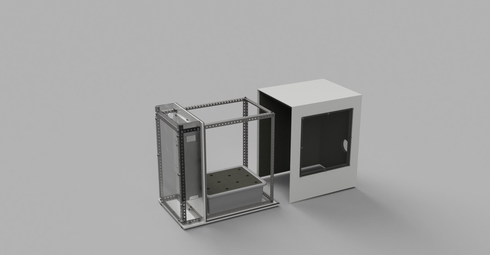

# DEPRECATED.

## Personal Food Computer 1.0

## Resources in this repository

- Guides
	- [Shell Assembly Guide](./Guides/ShellAssemblyGuide.md)
	- [Main Frame Assembly Guide](./Guides/MainFrameAssemblyGuide.md)
	- [Motherboard Assembly Guide(PDF only)](./Guides/PDF/MotherboardAssemblyGuide.pdf)
- CAD Models
	- [CAD Models(Solidworks)](./CAD)
	- [Laser Cutter DXF files](./CAD/LASERCUT)
	- [CNC Machine DXF Files](./CAD/CNCs)
- [Bill of Materials](./BOM.xlsx) (There are multiple sheets in the book, check bottom tabs.)

## External Links
- [Overview/Wiki](http://wiki.openag.media.mit.edu/food_computer_1)
- [Build Video](https://youtu.be/Jx-y0jQJlfs)
- ["Build" Page on OpenAg Website](http://openag.media.mit.edu/build/)
- [Adrian Lu protoshield wiring](http://adrianllu.com/2016/04/17/motherboard-build-notes-part-1-micro-controller-protoshield/)
- [JoshSinykin's wiring diagram](http://forum.openag.media.mit.edu/t/about-the-instructions-category/19/2)
