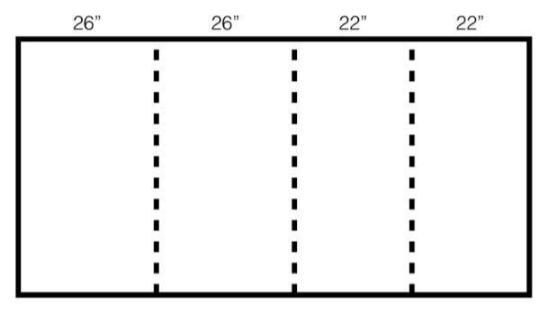
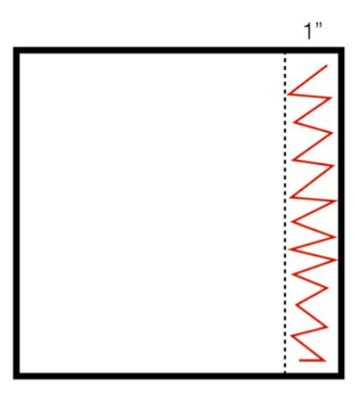
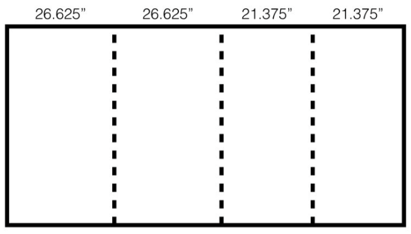
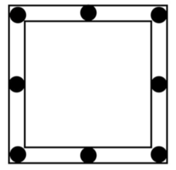
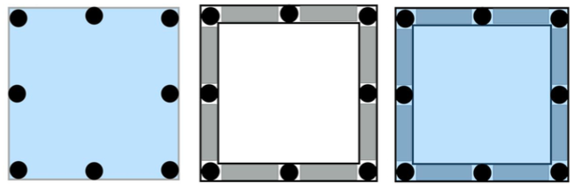

# Shell Assembly Guide

## Cutting the Insulation Foam

If you are cutting using a standard table saw, I found that it is easier to cut the large 4’x8’ sheet into sections slightly larger than the ultimate panel dimensions. This both makes each individual panel easier to work with and provides a clean opposite to the final cut width.



Once the sheets have been cut into the approximate panel dimensions, you can then cut the actual dimensions in the CAD.

```
Front Panel: 25.6875” x 30.625”
Back Panel: 25.6875” x 30.625”
Side Panel: 19.375” x 30.625”
Top Panel: 21.375” x 25.6875”
```

Next you need to cut the window into the front panel. I created a jig but a ruler works just fine. From the upper left corner as the origin of a cartesian system, measure 3.25” in the +x direction and 3.1875 in the ­y direction. This will be the upper left corner of the window. The dimensions of the window are 18.75” wide by 19.3125” tall. See picture below for relative orientation if confused. Cut out the window and discard the scrap.


Front Panel, Back Panel, Side Panel, and Top Panel

## Gluing Together the Foam Box

*Follow the video and consult the CAD for better visuals on how to assemble the box*

Using hot glue, lay down a continuous zigzagging line about an inch wide along one of the edges to be glued.



Firmly push the mating panels together and hold while the glue dries. The front and back panels should be on the outermost face, while the side panel sits between the front and back panels. The top panel should be placed on the top of the front, side, and back panels.


## Taping the Edges

Once the box has been glued together, the exposed edges where the yellow insulation foam can be seen need to be covered up. Using foil tape, cover all exposed edges so that no foam can be seen.


## Cutting the Corruplast

Because the panel dimensions of the corruplast are larger than the foam, cutting approximate dimensions is not possible. In fact, the width dimensions of the panels add up perfectly to 8’ or 96”. So cutting along the exact lines is the only way to make use of the whole panel. Note, due to the width of the saw blade, each panel will be missing between 1/16” ­ 1⁄8” of material. This has not been a problem for us though.



The exact dimensions are as follows:

```
Front Panel: 26.625” x 32.5625”
Back Panel: 26.625” x 32.5625”
Side Panel: 21.375” x 32.5625”
Top Panel: 21.375” x 26.4375”
```

Like the foam, next you need to cut the window into the front panel. I created a jig for this as well but a ruler works just fine. From the upper left corner as the origin of a cartesian system, measure 3.5” in the +x direction and 3.875 in the ­y direction. This will be the upper left corner of the window. The dimensions of the window are 19.75” wide by 20.3125” tall. Cut out the window and discard the scrap.

## Gluing the Corruplast to the Foam Box

We make use of Loctite spray adhesive with the web spray nozzle feature to get good coverage.


The directions on the bottle specify that each component get two coats of adhesive, spaced about 2­5min apart. The general procedure involved applying a coats of adhesive to both the corruplast and foam then carefully sticking the corruplast panels onto the foam box.

Refer to the CAD model and video to see orientation of the corruplast sheets and procedure of gluing. There will be a lip left on the bottom left side edges of the foam box. This is so that corruplast covers the PVC sheets for aesthetic purposes. When applying adhesive, be careful not to get too close to the hanging edge. The glue dries non­tacky so it isn’t much of a problem if a little glue gets on these regions. For alignment purposes, see that the corruplast creates a ~.5” rim around the center window. This will be where weatherstripping goes.

## Cutting the Window Plate

Using a tablesaw, cut a sheet of 1⁄8” polycarbonate to 19.75” x 30.3125”. Round the edges with a wood file and set aside. This will be the window plate.

## Creating the Window Seal and Magnetic Connection

Using the double­sided high­bond foam tape, stack two of the 0.75” neodymium disk magnets and tape one stack on each of the corners of the window, and in the middle of each of the edges of the window. Make sure all the magnets are the same polarity facing outward.



Place strips of weatherstripping between the magnets in the .5” gap left by the corruplast.


Finally, foam tape magnets to the outside face of the window plate by aligning the window plate with the window in the shell, and placing the magnets over the stacks below.




Window Off


Window On
